# Capstone Project

#### Overview
The idea is to create a model that predicts what the fuel consumption of a car would be at the end of short or medium period, based on previous consumption. for this I am going to use time series to me make a forecast.

Some companies use cards called "fuelcards" that they give to their drivers so they can tank their vehicles and in this way companies can keep track of how much money they spend on gasoline. This is a Dataset that contains information of one vehicle and their consumption during 2017 to 2024.

### Dataset:

The dataset has 622 entries and the next features:
 * date: date on which the car was filled with gasoline
 * unit_id: Vehicle id
 * make: Vehicle brand
 * model: Vehicle model
 * year: year of the vehicle
 * engine: cylinder
 * mpghighway: how many miles you travel per gallon on the highway
 * mpgcity: how many miles you get per gallon in the city
 * tankSizeGallons: tank size
 * status: If the fuelcard is active
 * site_city: city
 * quantity: Tanked quantity
 * unit_of_measure: Unit of measurement in which the vehicle was tanked
 * price: purchase price
 * odometer: odometer consumed since the last purchase
 * currency: currency in which the payment was made
 * site_state: state code

###  Understanding the Data
We start cleaning the data set, it has 262 null dates that could not be formatted correctly, so we discard them.
We also detect and remove outliers, we deleted 12 rows in this process.

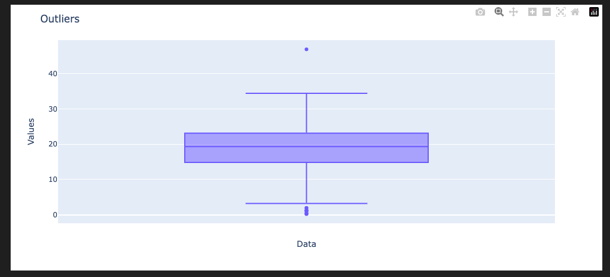

##### Analysis

Plotting the initial data we can reach the following conclusions:

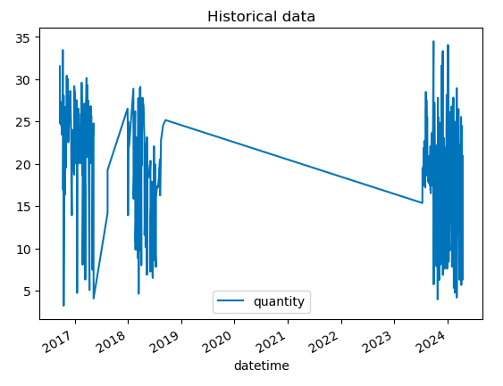

1) As we can see we have 3 main periods and we also have some years with empty data.
2) The information is not divided by date, there are some days when we have two or more rows and other days without data, since the vehicle is not filled with gasoline every day.

To solve problem 1, we are going to work with data from 2023 onwards, since it is the most recent data, consumption patterns may have changed since 2018, so we are going to work with the most recent data

To solve problem 2, we are going to complete the information on the missing days, dividing the last consumption into the days for which there are no records.

After executing this 2 process we obtained the following plot:

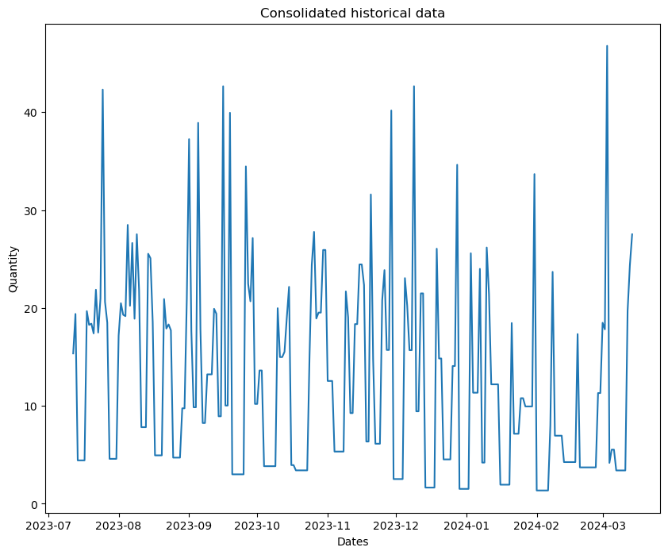

### Autocorrelation (ACF) and Partial Autocorrelation (PACF) Historical Data

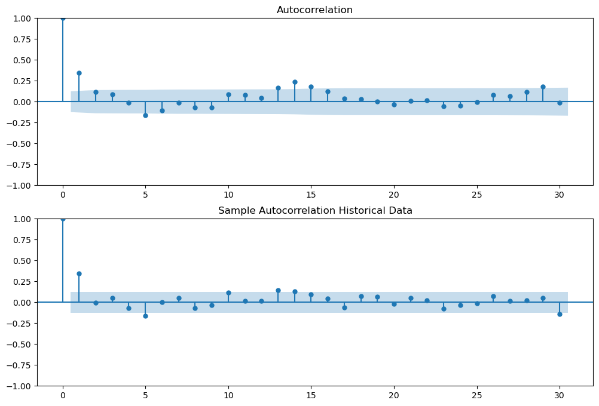

### Evaluating stationarity

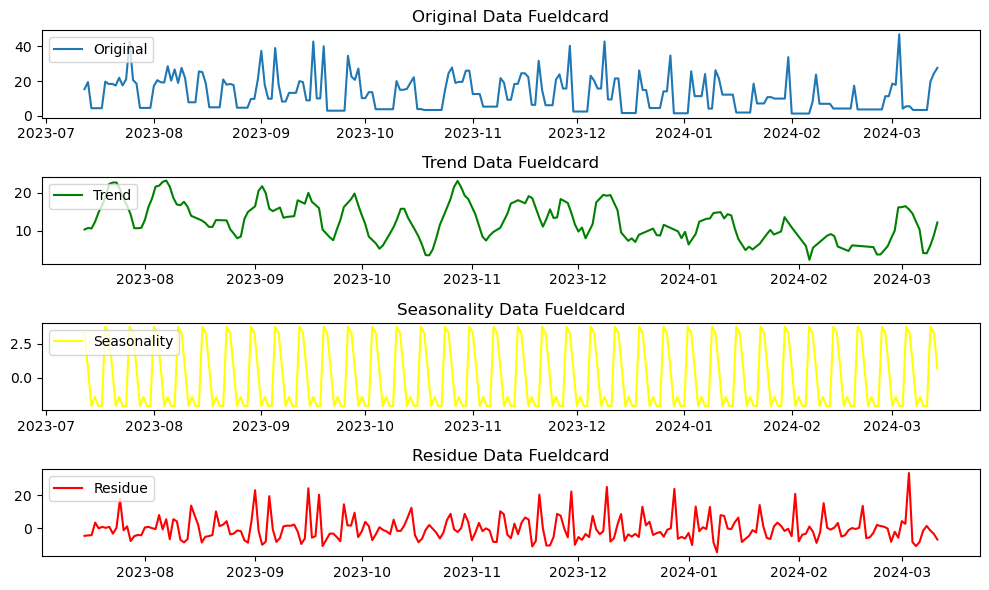

Trend: We have not a clear trend in the data

Seasonality: We have certain peaks each time the vehicle's tank is filled and we have a drop in the days when it is not necessary to fill the vehicle's tank.

I evaluated the data with the Dickey-fuller (adfuller) test, the result of this analysis is that the data are stationary

### Arima Model

For this analysis I started with the parameters p=5,d=0,q=5 since after analyzing the ACF and PACF plots
It looks like these have some autocorrelation to cover at lag 5.

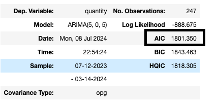

Summarizing the model we realize that the AIC metric has a value of 1801.

To help me find the best parameters I used auto_arima which helps me with this objective through Grid Search. according to this the best model is (1,1,1) So I created an Arima model with those parameters and this was the result:

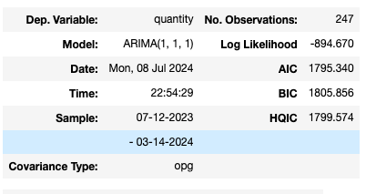

* parameters 5,0,5 = AIC 1801.350
* parameters 1,1,1 = AIC 1795.340

The Akaike Information Criterion (AIC) with parameters 5,0,5 is greater than 1,1,1, so we can conclude that 1,1,1 is less complex.

#### Making predictions
The predictions are not so far from the real data
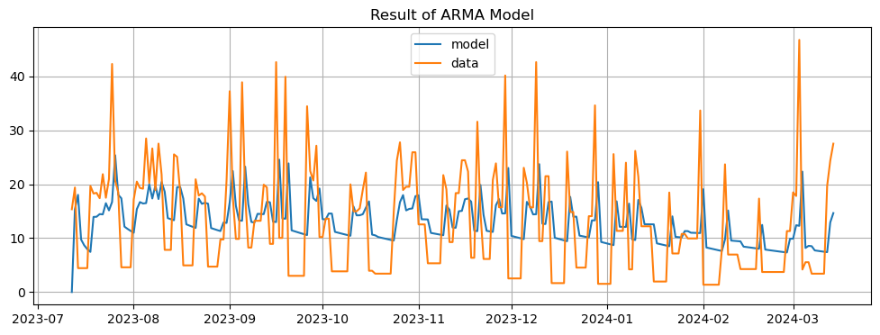

We can see that there could be autocorrelation in lag number 5 of the residual, however we could fall into overfitting

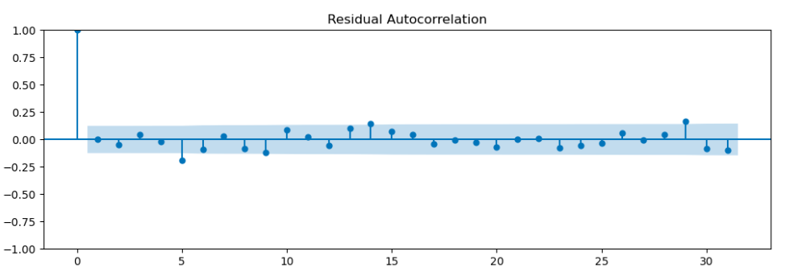

it Looks near to a normal distribution, there is only a peak around -9 which is a lot higher than the curve

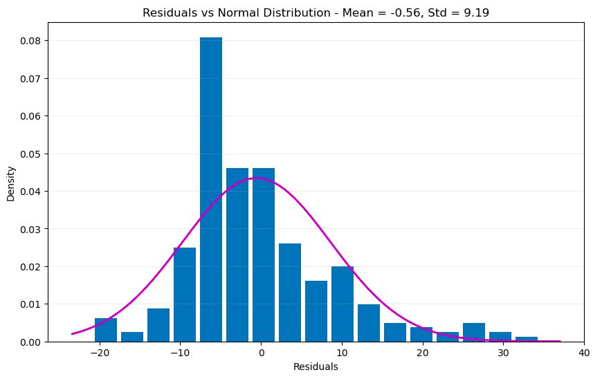

### Forecast last month

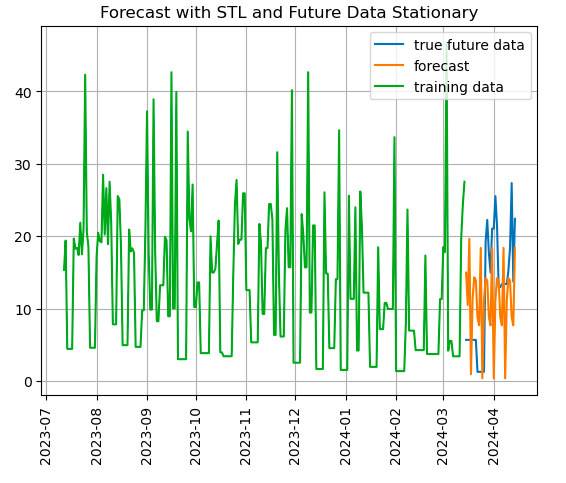

#### Conclusions

We proceeded to evaluate the data and made the necessary adjustments such as grouping the information by days,
Fill in the days that did not have information and consolidate the data on the amount of gasoline. We were able to verify that the data correspond to a stationary time series,
We use tools such as ACF and PACF to study the correlation and generate an ARIMA model with which we obtained.
the following result for the analysis of a period of 31 days:

* Total real Fuel consumption: 385.85
* Forecast Fuel consumption: 343.74

We obtained a MAE: 7.65 and RMSE: 9.13. Taking into account that a period of 31 days is a medium-term prediction, I think the model behaves in a good way and the error is not very high.